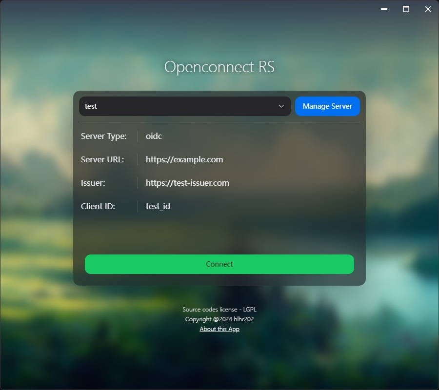
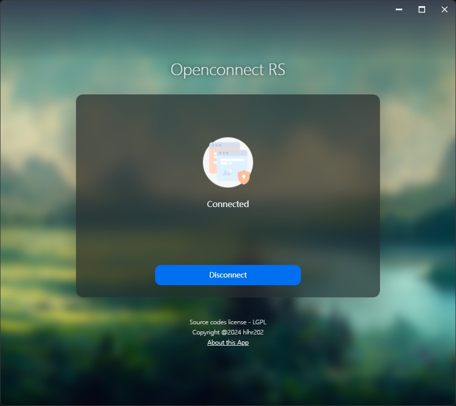

# OpenConnect for Rust

WORK IN PROGRESS

This is a cross-platform GUI client for OpenConnect, written in Rust and designed to work seamlessly on Windows, Linux, and macOS desktop systems. The program utilizes various technologies including MSYS2, Tauri, React, and NextUI. It provides a user-friendly interface for connecting to VPN servers using both password and OIDC authentication methods.

## Features

- Cross-platform compatibility (Windows, Linux, macOS)
- Easy-to-use GUI interface
- Support for both password and OIDC authentication
- Built with MSYS2, Tauri, React, and NextUI

## Screenshots

## Getting Started

- Read the [System Requirements](./crates/openconnect-sys/README.md) for environment setup
- Modify it to fit your environment (For automatic setup, its WIP)
- For windows, since openconnect provides GNU automake, we currently only support MSYS2-MINGW64 and `x86_64-pc-windows-gnu` toolchain
  - Install MSYS2
  - Install `x86_64-pc-windows-gnu` toolchain with command `rustup default stable-x86_64-pc-windows-gnu`
  - Run cargo under MINGW64 shell

## License

This project is licensed under the GNU Lesser General Public License (LGPL). See the [LICENSE](./LICENSE_LGPL) file for details.

## Acknowledgements

Special thanks to (MORE THAN) the following projects and technologies for making this project possible:

- [OpenConnect](https://www.infradead.org/openconnect/)
- [MSYS2](https://www.msys2.org/)
- [Tauri](https://tauri.app/)
- [Tokio](https://tokio.rs/)
- [Windows-rs](https://github.com/microsoft/windows-rs)
- [OpenIDConnect](https://github.com/ramosbugs/openidconnect-rs)
- [React](https://reactjs.org/)
- [NextUI](https://nextui.org/)
- [Vite](https://vitejs.dev/)

## TODO

### Openconnect sys

- [ ] Automatically search library path
- [ ] Automatically build openconnect

### Openconnect core

- [x] implement safe ffi
- [x] implement password login
- [x] implement cookie login
- [ ] implement public key login
- [ ] implement ssl certificate validation

### Client

- [x] implement password login
- [x] implement oidc login
- [ ] implement logs
- [ ] implement CLI
